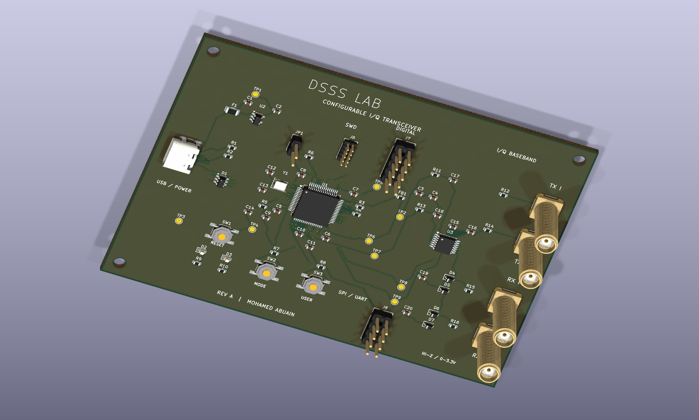

# DSSS Lab

**Configurable spread-spectrum hardware with Python and MATLAB communications experiments.**

[](https://github.com/MAbuain17/dsss-lab/actions/workflows/validate.yml)
[](https://github.com/MAbuain17/dsss-lab/actions/workflows/matlab.yml)

The project combines a 2 MHz bench implementation with a configurable USB-controlled I/Q board design. Rev A uses an STM32G474, dual DAC outputs, receive inputs and a digital expansion interface to make payload, spreading code and modulation programmable.



## Configurable hardware — Rev A

| Area | Design |
|---|---|
| Data | User bits, text, hexadecimal payloads, PRBS and repeating patterns |
| Spreading | Selectable LFSR taps, seed, code phase and spreading length; uploaded sequences |
| Modulation | BPSK, QPSK, OOK and continuous-phase 2-FSK in the firmware specification |
| Analogue | Buffered TX I/Q, filtered and protected RX I/Q, four labelled SMA ports |
| Control | USB-C, reset/mode/user buttons, status LEDs and test points |
| Development | SWD/SWO programming, SPI/UART expansion, chip/data/PN/frame signals |
| PCB | 110 × 80 mm, four copper layers, routed nets, ground planes and M3 mounting holes |

Rev A is the schematic and PCB design stage; firmware and board bring-up are next. [Explore the hardware design](hardware/configurable/README.md), [open the schematic](hardware/configurable/renders/schematic.svg), or inspect the [PCB files](hardware/configurable/dsss-configurable.kicad_pcb).

## Explore the project

| Topic | Open |
|---|---|
| PCB architecture, BOM and renders | [Configurable hardware](hardware/configurable/README.md) |
| Signal modes and USB commands | [Control interface](hardware/configurable/control-interface.md) |
| Original bench build and captures | [Laboratory implementation](hardware/README.md) |
| BER, interference and synchronization | [Simulation results](docs/results.md) |
| Signal-chain conventions and parameters | [Methodology](docs/methodology.md) |
| Python, MATLAB and Octave setup | [Getting started](docs/getting-started.md) |

## Run Python

From the repository root, using Python 3.10 or later:

```bash
python -m pip install -e .
python -m unittest discover -s tests -v
python examples/burst_link.py
python -m dsss_lab.experiments
python examples/pulse_shaping.py
```

For a smaller run, add `--quick` to the experiment command. CSV files, figures and environment metadata are written to `results/`. Running without installing is also possible with `PYTHONPATH=src` on Linux/macOS; see the Windows guide for PowerShell.

## Run MATLAB

No Communications Toolbox is required. From the repository root:

```matlab
addpath('matlab');
test_dsss;
run_experiments('results/matlab', 12000);
advanced_demo('results/matlab');
```

MATLAB shares deterministic test vectors with Python. Random-number streams differ, so Monte Carlo results should agree statistically, not bit-for-bit. **Python, GNU Octave and native MATLAB pass the published GitHub Actions validation workflows.** Native MATLAB runs automatically when its implementation, shared vectors or workflow changes and remains manually dispatchable.

## What the software explores

| Area | Implemented experiments |
|---|---|
| Data | Random bits, constants, alternating patterns, bursts, UTF-8 text, 8-bit PCM, CRC32 frames |
| Spreading | Exact hardware XNOR recurrence, code phase, autocorrelation, configurable spreading length, two-user Gold-family interference |
| Channels | AWGN; in-band and out-of-band tones; swept interference; burst noise; multipath; symbol-independent Rayleigh fading |
| Receiver | Coherent despreading, known-preamble delay/CFO acquisition, burst phase correction, known-channel matched combining |
| Front end | Carrier offset, phase offset/noise, fractional timing error, ADC clipping/quantization, IQ imbalance, RRC pulse shaping |
| Measurements | BER with Wilson intervals, frame CRC failure rate, acquisition success, raw decision EVM, Welch PSD and 99% occupied bandwidth |
| Coding | Soft repetition decoding with equal information-bit energy as a normalization check |

## BER and interference


At equal information-bit energy, DSSS and ordinary coherent BPSK have the same theoretical BER in AWGN. Spreading's interference behaviour depends on the interferer's spectrum and the receiver. The experiments include cases where DSSS helps and cases where the narrower unspread receiver performs better.


The simulation uses 60,000 bits per AWGN point and 30,000 bits per interference point. Source CSVs include error counts and confidence intervals; seeds and model settings are documented in [methodology](docs/methodology.md).


## Credits

Project by **Mohamed Abuain**. The university bench implementation was supervised by Prof. Tammam Benmusa. Its circuit reference and source article are recorded in the [design references](docs/attribution.md).

[Software licence](LICENSE.md) · [Changelog](CHANGELOG.md) · [Roadmap](docs/roadmap.md)
