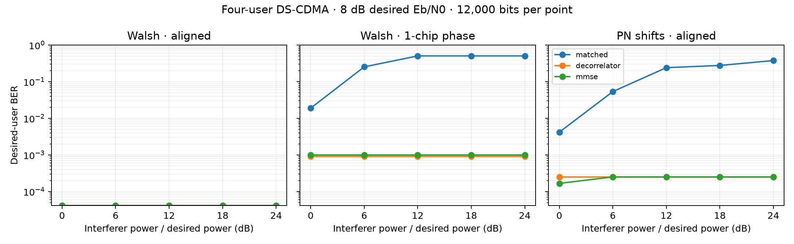

# From DSSS link to multiuser CDMA

Direct-sequence CDMA assigns different spreading signatures to simultaneous users in the same channel. A receiver projects the composite waveform onto a user's code; code cross-correlation, relative power and chip timing then determine how much multiple-access interference remains. This extension studies those three effects with an energy-normalized BPSK baseband model.

## Signal and receiver architecture

For user `u`, each bit maps to `b_u ∈ {+1, −1}` and a unit-energy signature `c_u`. The received chip vector in one symbol interval is

```text
r = Σ_u sqrt(P_u) b_u c_u + j + n
```

Here `P_u` is energy relative to the desired user, `j` is an optional single tone, and each real AWGN chip has variance `N0/2`. The code matrix `C` contains one signature per user. The model offers 32-chip Walsh rows and 31-chip circular shifts of the laboratory PN recurrence. A chip-phase control rotates interfering signatures within each symbol interval. It exposes loss of Walsh orthogonality while retaining a common symbol boundary.

Three detectors use the same received chips:

| Receiver | Decision statistic | What it tests |
|---|---|---|
| Matched filter | `C r` | Direct code correlation and multiple-access interference |
| Decorrelator | `(C Cᵀ)⁻¹ C r` | Separating users by their known signature matrix |
| Linear MMSE | `(C Cᵀ + (N0/2) diag(P_u⁻¹))⁻¹ C r` | Noise-aware suppression with each user's configured power |

All three recover a sign decision for every user. The sweep reports desired-user bit errors and BER, plus the maximum off-diagonal signature correlation. The decorrelator and MMSE paths use the configured user signatures; the trial therefore isolates multiple-access detection from code estimation.

## Reproduce the comparison

```bash
python -m pip install -e .
python -m unittest discover -s tests -v
python examples/cdma_study.py
```

The example generates [`cdma_near_far.csv`](../results/cdma_near_far.csv) and the figure below. Each point uses 12,000 desired-user bits, four simultaneous users, 8 dB desired-user Eb/N0 and seed 20260927. The interferers share a controlled relative power from 0 to 24 dB. The aligned Walsh, one-chip-shifted Walsh and PN-shift cases use identical trial conditions.



Aligned Walsh signatures maintain zero pairwise correlation in this model, so matched filtering separates the users. A chip-phase change breaks that orthogonality. PN shifts have low nonzero correlation; strong interfering users can therefore bias the matched-filter decision. The decorrelator removes known signature cross-talk, while MMSE trades some residual interference for lower noise amplification. The CSV gives exact error counts for judging differences near the experiment's finite resolution.

## Explore the channel

The [interactive CDMA explorer](../visualizer/index.html) runs a small chip-level experiment in the browser. It shows the signature correlation matrix, received chip waveform, per-user decisions and desired-user BER while changing user count, code family, chip phase, near–far level, Eb/N0, narrowband jammer and detector. It extends the teaching idea in [Güvenç's DSSS jamming-margin visualizer](https://ismailguvenc.github.io/dsss-jamming-visualizer/) from a single-user jammer to multiuser interference and detection.

The model uses a common symbol clock and flat real baseband channel. The optional tone is an injected waveform at 0.073 cycles/chip; it is distinct from the multiuser interference sweep. The [methodology page](methodology.md) records the general DSSS energy and noise conventions.
