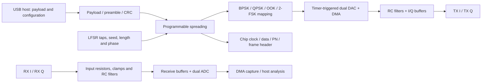

# Configurable DSSS transceiver — Rev A

A USB-controlled I/Q baseband board built around the STM32G474RET6. The architecture replaces fixed logic with programmable data generation, spreading and symbol mapping, while exposing both analogue channels and digital timing signals for measurement.

**Design:** 110 × 80 mm · four copper layers · 70 circuit components · four SMA ports · USB-C · SWD · SPI/UART expansion.

## Configurable signal chain

## Planned operating controls

| Control | Options |
|---|---|
| Payload | User bit string, hexadecimal bytes, UTF-8 text, PRBS, alternating bits, all-zero/all-one and repeating patterns |
| PN sequence | Configurable Fibonacci LFSR order, feedback taps, seed, code phase and spreading length; optional uploaded chip sequence |
| Modulation | BPSK, Gray-mapped QPSK, OOK and continuous-phase 2-FSK |
| Timing | Chip rate, samples per chip, burst duration, frame spacing and repeat count |
| Framing | Preamble, length, payload and CRC32; raw chip mode for scope captures |
| Experiments | I/Q loopback, code mismatch, delay sweeps, burst acquisition and known-pattern BER comparisons |
| Instrumentation | Digital chip clock, data, PN and frame signals; DAC/ADC test pads; status LEDs |

Rev A includes the schematic, routed PCB and control specification. Firmware and board bring-up are the next development stage. The Python/MATLAB simulations remain available for numerical experiments.

## Hardware blocks

| Block | Implementation |
|---|---|
| Processing | STM32G474RET6, LQFP64; Cortex-M4 with hardware timers, DMA, dual DAC and multiple ADCs |
| USB | GCT USB4105 USB-C connector, separate 5.1 kΩ CC pull-downs, USBLC6 protection and 22 Ω data-line resistors |
| Power | USB 5 V, 500 mA PTC, AP2112K 3.3 V regulator; ferrite-filtered analogue rail and local decoupling |
| Clock | 8 MHz crystal with load capacitors; USB clock configuration described in the firmware plan |
| Transmit | PA4/PA5 DAC outputs, 1 kΩ / 1 nF RC filters, TLV9064 unity-gain buffers and 100 Ω output isolation |
| Receive | Series input resistance, Schottky clamps, 1 kΩ / 1 nF RC filtering, TLV9064 buffers and PC0/PC1 ADC inputs |
| Development | SWD/SWO, reset button, boot jumper, mode/user buttons, TX/RX LEDs and SPI/UART header |
| Mechanical | Four M3 mounting holes, separated USB/power, processing and analogue regions, labelled SMA ports |

The SMA connections carry **DC-biased baseband I/Q**, with high-impedance loading. They are not antenna outputs or 50 Ω line drivers. The default development target is 25 kchip/s at four samples/chip; the analogue RC corner is approximately 159 kHz. Rate limits depend on firmware timing, conversion settings and filter response.

## Design files

| File | Contents |
|---|---|
| [KiCad project](dsss-configurable.kicad_pro) | Board rules and project settings |
| [Schematic](dsss-configurable.kicad_sch) | Connected component-level design |
| [PCB](dsss-configurable.kicad_pcb) | Four-layer layout, copper tracks, vias and filled ground planes |
| [Local symbol library](dsss-configurable.kicad_sym) | Embedded component symbols for the project |
| [Schematic preview](renders/schematic.svg) | Browser-readable circuit drawing |
| [Top view](renders/board-top.png) | Component placement and silkscreen |
| [Copper view](renders/copper.svg) | Routed layout |
| [Bill of materials](bom.csv) | References, values and footprints |
| [Pin map](pin-map.md) | MCU peripheral and connector assignments |
| [Control interface](control-interface.md) | Proposed USB commands, modes and frame format |
| [Design review](design-review.md) | Connectivity checks and next review items |

Open `dsss-configurable.kicad_pro` in KiCad 10. The standard footprint and 3D model libraries supply the component geometry; the local symbol library is included in the project.

## Component references

- [ST STM32G474RE datasheet](https://www.st.com/resource/en/datasheet/stm32g474re.pdf)
- [TI TLV9064](https://www.ti.com/product/TLV9064)
- [Diodes AP2112 datasheet](https://www.diodes.com/datasheet/download/AP2112.pdf)
